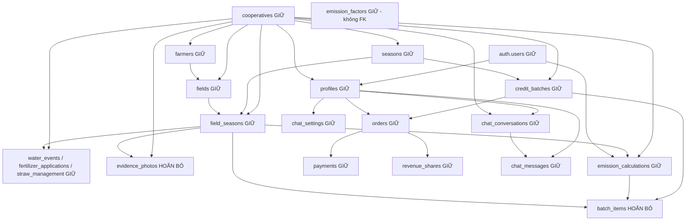

# Audit phần sẽ bị thay và phác thảo schema mới

Ngày audit: 06/09/2026. Căn cứ: `PLAN.md:27` (entity model), `PLAN.md:87` (trình tự triển khai). Đây là audit tĩnh mã nguồn và migration trong repo, **không xác nhận trạng thái DB đang chạy**. Không chạy ứng dụng, test, migration hay truy vấn DB; chỉ ghi báo cáo này. Các tham chiếu chatbot/auth chỉ được đọc để xác định phụ thuộc, không chỉnh sửa vùng được giữ.

## 1. Kết luận quyết định phạm vi

1. **Bỏ module/giao diện cũ không đồng nghĩa được DROP bảng cũ.** Chatbot hiện tra dữ liệu canh tác, MRV và thị trường thật. Trong 17 bảng ứng dụng của migration 0001–0009, 15 bảng có phụ thuộc đọc trực tiếp/qua quan hệ từ chatbot hoặc auth; chỉ `batch_items`, `evidence_photos` chưa thấy chatbot đọc trực tiếp. Cả hai vẫn có dữ liệu và phụ thuộc nghiệp vụ cần bảo toàn. Bằng chứng chi tiết ở mục 3.
2. **Giữ `auth.users`, `profiles`, `cooperatives`, `user_role`, các helper/trigger auth và toàn bộ đối tượng chat.** Thêm quyền dự án bằng `project_members.role`, không đổi nghĩa `profiles.role`. Xoá profile còn kéo xoá hội thoại/tin nhắn; bỏ `app_is_admin()` làm hỏng quyền cập nhật cấu hình chatbot (`supabase/migrations/0010_chat.sql:12`, `supabase/migrations/0011_chat_settings.sql:44`).
3. **Xây schema mới theo hướng chỉ bổ sung.** Engine MRV cũ có thể làm bộ tính tham chiếu cho lúa nước, nhưng chưa phải engine methodology tổng quát; form/import cần hợp đồng JSONB có phiên bản, validation, đơn vị và biểu thức tính an toàn (`src/lib/mrv/engine.ts:118`, `src/lib/mrv/factors.ts:14`).

## 2. Bảng kê file/route và khả năng tái dụng

Trong bảng dưới, các tên file tương đối nằm dưới thư mục ghi ở cột đầu; `:1` là điểm vào file. “Thay” là kế hoạch cho bước triển khai sau, không phải thao tác đã làm.

| Route/thư mục | File sẽ thay | Chức năng và phụ thuộc đáng chú ý |
|---|---|---|
| `/htx` — `src/app/htx` | `page.tsx:1` | Dashboard farmers/fields/seasons/calculations/batches (`src/app/htx/page.tsx:15`). |
| `/htx/nong-ho` — `src/app/htx/nong-ho` | `page.tsx:1`, `form.tsx:1`, `actions.ts:1` | Danh sách/tạo nông hộ; ghi `farmers` (`src/app/htx/nong-ho/actions.ts:17`). |
| `/htx/thua-ruong` — `src/app/htx/thua-ruong` | `page.tsx:1`, `editor.tsx:1`, `actions.ts:1` | Danh sách qua `fields_view`, vẽ polygon, RPC `save_field` (`src/app/htx/thua-ruong/page.tsx:23`, `src/app/htx/thua-ruong/actions.ts:27`). |
| `/htx/mua-vu`, `/htx/mua-vu/[id]` — `src/app/htx/mua-vu` | `page.tsx:1`, `form.tsx:1`, `actions.ts:1`, `[id]/page.tsx:1`, `[id]/enroll.tsx:1` | Tạo mùa vụ, đăng ký thửa bằng upsert `(season_id,field_id)` (`src/app/htx/mua-vu/actions.ts:51`). |
| `/htx/thua-vu/[id]` — `src/app/htx/thua-vu/[id]` | `page.tsx:1`, `forms.tsx:1`, `actions.ts:1`, `calculation.tsx:1` | Ngày canh tác, nhật ký nước/phân/rơm, tính MRV, mở khoá (`src/app/htx/thua-vu/[id]/actions.ts:13`, `src/app/htx/thua-vu/[id]/actions.ts:128`). |
| `/htx/lo-tin-chi`, `/htx/lo-tin-chi/[id]` — `src/app/htx/lo-tin-chi` | `page.tsx:1`, `form.tsx:1`, `actions.ts:1`, `[id]/page.tsx:1`, `[id]/controls.tsx:1` | Tạo/gộp/chào bán lô; không thuộc Module A/B mới (`src/app/htx/lo-tin-chi/actions.ts:38`, `src/app/htx/lo-tin-chi/actions.ts:53`). |
| `/htx/he-so` | `src/app/htx/he-so/page.tsx:1` | UI tra hệ số/vùng miền; dữ liệu hệ số vẫn phải giữ cho chatbot (`src/app/htx/he-so/page.tsx:22`). |
| `/cho`, `/cho/[id]` — `src/app/cho` | `page.tsx:1`, `actions.ts:1`, `[id]/page.tsx:1`, `[id]/order-form.tsx:1` | Thị trường, đặt mua, action thanh toán dùng từ `/don-hang` (`src/app/cho/actions.ts:18`, `src/app/cho/actions.ts:42`). |
| `/don-hang` — `src/app/don-hang` | `page.tsx:1`, `payment-panel.tsx:1` | Đơn hàng, lịch sử thanh toán, thanh toán sandbox (`src/app/don-hang/page.tsx:26`). |
| `/quan-tri` | `src/app/quan-tri/page.tsx:1` | Dashboard HTX, lô, doanh thu; bản thân page mount `ChatWidget` (`src/app/quan-tri/page.tsx:7`). **Không xoá thư mục `quan-tri/tro-ly`.** |
| Layout gắn với module cũ | `src/app/htx/layout.tsx:1`, `src/app/cho/layout.tsx:1`, `src/app/don-hang/layout.tsx:1` | Chỉ thay có chọn lọc: chứa `AppNav`/`ChatWidget`; layout HTX còn bao `/htx/tro-ly`. Không xoá hàng loạt `htx/**` (`src/app/htx/layout.tsx:17`). |

**Ngoại lệ bắt buộc:** giữ `/htx/tro-ly` dù nằm trong cây HTX; giữ `/quan-tri/tro-ly` và vùng chatbot, landing, đăng nhập/đăng ký, auth nêu trong brief. `/thiet-lap` không thuộc danh sách route audit chính nhưng là phụ thuộc chuyển tiếp cần phối hợp: gọi hai RPC onboarding và redirect `/htx`; auth đăng ký buyer redirect `/cho` (`src/app/thiet-lap/actions.ts:14`, `src/app/thiet-lap/actions.ts:39`, `src/app/auth-actions.ts:69`).

| Tài sản | Quyết định tái dụng |
|---|---|
| `src/lib/mrv/engine.ts:18`, `src/lib/mrv/types.ts:25` | Giữ hàm thuần, cặp baseline/project, trace hệ số làm tham chiếu và adapter lúa nước. Các type nước/rơm/đạm không áp trực tiếp cho rừng, biogas, năng lượng. |
| `src/lib/mrv/factors.ts:60` | Tái dụng ý tưởng version, chọn hệ số theo scope, dừng khi thiếu hệ số, lưu `ef_c_source_key`. Hiện dùng `CURRENT_METHODOLOGY` toàn cục và danh sách key cố định; thiết kế mới phải gắn bộ hệ số vào version methodology. **Chưa xoá file:** chatbot import tại `src/lib/chat/handlers.ts:4`. |
| `src/lib/mrv/collect.ts:63`, `src/lib/mrv/collect.ts:91` | Giữ `daysBetween`/`missingMrvInputs` theo hợp đồng cũ vì chatbot dùng. Viết adapter mới cho MonitoringData; collector hiện join bảng lúa nước cố định. `computeAndSave` chỉ tái dụng mô hình lưu snapshot, không chép cách ghi không nguyên tử (`src/lib/mrv/collect.ts:215`). |
| `src/lib/market/**` | Không có file trong cây làm việc hiện tại. Nghiệp vụ nằm ở `src/app/cho/actions.ts:7`, `src/app/htx/lo-tin-chi/actions.ts:7` và migration 0005; không có thư viện market để chuyển nguyên khối. |
| `src/lib/gis/area.ts:11` | Tái dụng diện tích preview/GeoJSON nếu dự án mới cần bản đồ; PostGIS vẫn là nguồn diện tích phía server. `ringToGeoJson` chưa chặn ring rỗng (`src/lib/gis/area.ts:27`). |
| `src/lib/format.ts:10` | Giữ formatter số, ngày, ha, tCO2e; VND dùng lại khi cần. Đây là tiện ích hiển thị, không dùng số đã format làm đầu vào phép tính. |
| `src/lib/labels.ts:5` | **Không xoá file hoặc các export chatbot đang dùng**: role, season, straw, batch/order/payment (`src/lib/chat/prompt.ts:2`, `src/lib/chat/handlers.ts:7`). Thêm nhãn stage/task/member độc lập về sau. |
| `src/lib/region.ts:13` | Không đưa mặc định `north`, `early/late` hoặc hệ số UI hard-code vào model đa methodology. Giữ tạm cho onboarding hiện tại (`src/app/thiet-lap/actions.ts:6`); đưa scope tham chiếu vào schema mới. |
| `src/components/ui.tsx:1`, `src/components/app-nav.tsx:72`, `src/components/field-map.tsx:1` | Có thể tái dụng UI cơ bản, PageHeader, bản đồ. Menu/role AppNav cần thiết kế lại có kiểm soát; hiện dùng chung với phần được giữ (`src/components/app-nav.tsx:6`). |
| `src/types/database.ts:9`, migrations 0001–0012 | Giữ lịch sử migration và types hiện có. Về sau bổ sung/regenerate types phải giữ chat/auth/legacy; không thay cả file bằng types riêng của schema mới. |

## 3. Schema DB hiện tại và bảng không được xoá

Quy ước: mọi bảng ứng dụng dưới đây có PK `id uuid`, trừ `chat_settings.id boolean`; `C` = ON DELETE CASCADE, `N` = SET NULL, `R` = RESTRICT. Cột quan hệ trỏ đến `id` nếu không ghi khác. **GIỮ** = thuộc hợp đồng chatbot/auth hiện hành; **HOÃN BỎ** = module không còn dùng nhưng chưa đủ căn cứ xoá dữ liệu.

| Bảng | Cột chính, unique, FK | Kết luận và nguồn |
|---|---|---|
| `cooperatives` | `name, code UNIQUE, province, district, commune, region, contact_*`; region thêm ở 0008 | **GIỮ** auth/onboarding, tên HTX và region của chatbot. `supabase/migrations/0001_core_schema.sql:28`, `supabase/migrations/0008_vietnam_regional_factors.sql:20`, `src/app/api/chat/route.ts:90`. |
| `profiles` | PK/FK `id → auth.users C`; `full_name, phone, role user_role, cooperative_id → cooperatives N, company_name` | **GIỮ** auth, chủ chat, người mua. `supabase/migrations/0001_core_schema.sql:40`, `src/lib/auth.ts:20`. |
| `farmers` | `cooperative_id → cooperatives C`, `full_name, phone, village, member_code`; UNIQUE `(cooperative_id,member_code)` | **GIỮ chatbot** `src/lib/chat/handlers.ts:301`; schema `supabase/migrations/0001_core_schema.sql:73`. |
| `fields` | `cooperative_id → cooperatives C`, `farmer_id → farmers C`; `name, geom Polygon/4326, declared_area_ha, area_ha, soil_type`; GiST geom | **GIỮ chatbot** quan hệ lồng `src/lib/chat/handlers.ts:228`; schema `supabase/migrations/0001_core_schema.sql:86`. |
| `seasons` | `cooperative_id → cooperatives C`; `name, crop, start_date, end_date, is_locked, season_type` | **GIỮ chatbot** `src/lib/chat/handlers.ts:110`; schema `supabase/migrations/0001_core_schema.sql:119`, `supabase/migrations/0008_vietnam_regional_factors.sql:21`. |
| `field_seasons` | `cooperative_id → cooperatives C`, `season_id → seasons C`, `field_id → fields C`; UNIQUE `(season_id,field_id)`; ngày cấy/gặt, preseason/baseline water, lock | **GIỮ chatbot** `src/lib/chat/handlers.ts:133`; schema `supabase/migrations/0001_core_schema.sql:134`. |
| `water_events` | `cooperative_id → cooperatives C`, `field_season_id → field_seasons C`; `event_date, event_type, water_depth_cm, note` | **GIỮ chatbot** `src/lib/chat/handlers.ts:230`; schema `supabase/migrations/0001_core_schema.sql:152`. |
| `fertilizer_applications` | Hai FK như water_events; `applied_date, product_name, is_organic, organic_type, amount_kg, n_content_pct, dry_matter_pct`; check lượng ≥0, % trong 0–100, hữu cơ phải có loại | **GIỮ chatbot** `src/lib/chat/handlers.ts:231`; schema `supabase/migrations/0001_core_schema.sql:165`. |
| `straw_management` | Hai FK như water_events; `field_season_id UNIQUE`; `method, baseline_method, amount_t_per_ha, days_before_cultivation` | **GIỮ chatbot** `src/lib/chat/handlers.ts:232`; schema `supabase/migrations/0001_core_schema.sql:184`. |
| `evidence_photos` | Hai FK như water_events; `storage_path, caption, taken_at, lat, lng` | **HOÃN BỎ**; chưa thấy consumer trong `src` ngoài types. Chuỗi storage_path không phải FK tới storage.objects. `supabase/migrations/0001_core_schema.sql:196`. |
| `emission_factors` | `version, key, value numeric, unit, description, source`; UNIQUE `(version,key)`; không FK | **GIỮ chatbot** `src/lib/chat/handlers.ts:92`; schema `supabase/migrations/0002_mrv_and_market.sql:9`. |
| `emission_calculations` | `cooperative_id → cooperatives C`, `field_season_id → field_seasons C`, `computed_by → auth.users N`; `methodology_version, area_ha, cultivation_days`, baseline/project CH4/N2O/burning/CO2e, reduction, `inputs/factors jsonb, is_current, computed_at`; unique partial field_season khi current | **GIỮ chatbot** `src/lib/chat/handlers.ts:233`; schema `supabase/migrations/0002_mrv_and_market.sql:23`. `methodology_version` chỉ là text, không FK vào bộ hệ số. |
| `credit_batches` | `cooperative_id → cooperatives C`, `season_id → seasons N`; `code UNIQUE, name, status, gross/issuable/sold_co2e_t, buffer_pct, price_per_t_vnd, platform_fee_pct, coop_admin_fee_pct, listed_at` | **GIỮ chatbot** `src/lib/chat/handlers.ts:330`; schema `supabase/migrations/0002_mrv_and_market.sql:52`, `supabase/migrations/0005_business_rpc.sql:3`. |
| `batch_items` | `batch_id → credit_batches C`, `emission_calculation_id → emission_calculations R`, `field_season_id → field_seasons R`; `co2e_t`; UNIQUE `(batch_id,field_season_id)` | **HOÃN BỎ**: truy xuất nguồn gốc lô và RPC chia tiền phụ thuộc; chưa thấy handler chat đọc trực tiếp. `supabase/migrations/0002_mrv_and_market.sql:74`, `supabase/migrations/0005_business_rpc.sql:228`. |
| `orders` | `code UNIQUE`, `batch_id → credit_batches R`, `buyer_id → profiles R`; lượng >0, giá/tổng ≥0, `status,buyer_note` | **GIỮ chatbot** `src/lib/chat/handlers.ts:440`; schema `supabase/migrations/0002_mrv_and_market.sql:85`. |
| `payments` | `order_id → orders C`; `provider,provider_ref,amount_vnd,status,failure_reason,paid_at` | **GIỮ chatbot** quan hệ lồng `src/lib/chat/handlers.ts:444`; schema `supabase/migrations/0002_mrv_and_market.sql:101`. |
| `revenue_shares` | `order_id UNIQUE → orders C`; tiền platform/coop/farmer, `breakdown jsonb` | **GIỮ chatbot** quan hệ lồng `src/lib/chat/handlers.ts:375`; schema `supabase/migrations/0002_mrv_and_market.sql:116`. `breakdown.farmers[].farmer_id` là dữ liệu JSON, không có FK. |
| `chat_conversations` | `user_id → profiles C`, `cooperative_id → cooperatives N`; `title,created_at,updated_at` | **GIỮ tuyệt đối**; đọc bổ sung ngoài 0009 để thấy phụ thuộc. `supabase/migrations/0010_chat.sql:10`. |
| `chat_messages` | `conversation_id → chat_conversations C`, `user_id → profiles C`; `role chat_role,content,tool_calls jsonb,created_at` | **GIỮ tuyệt đối**. `supabase/migrations/0010_chat.sql:23`. |
| `chat_settings` | Singleton `id=true`; `provider,model,api_key,api_key_last4` generated, `updated_at,updated_by → profiles N` | **GIỮ tuyệt đối**, kể cả quyền cột che API key. `supabase/migrations/0011_chat_settings.sql:7`, `supabase/migrations/0011_chat_settings.sql:60`. |



Mũi tên là bảng cha → bảng chứa FK, không biểu diễn hành vi xoá; xem C/N/R ở bảng. `fields_view` là view security_invoker join fields/farmers, xuất GeoJSON (`supabase/migrations/0006_fields_api.sql:4`). PostGIS còn tạo `spatial_ref_sys`, các view `geography_columns`, `geometry_columns` và nhiều hàm extension: **không coi là bảng nghiệp vụ để dọn** (`src/types/database.ts:900`, `src/types/database.ts:1055`, `supabase/migrations/0007_harden.sql:88`).

Types phản ánh cả 0010/0011 và chữ ký RPC mới có `p_region`, không chỉ 0001–0009 (`src/types/database.ts:63`, `src/types/database.ts:150`, `src/types/database.ts:1242`). Có lệch nhỏ: `Enums.chat_role` tồn tại nhưng `Constants.public.Enums` không liệt kê chat_role (`src/types/database.ts:2052`, `src/types/database.ts:2214`). Types không mô tả RLS/trigger/quyền thực thi; không dùng types làm nguồn duy nhất khi thiết kế migration.

## 4. RPC, function, trigger, RLS và storage

### 4.1. Hàm do ứng dụng định nghĩa

| Hàm / trigger gọi hàm | Vai trò và hướng xử lý |
|---|---|
| `handle_new_user()` ← `on_auth_user_created` trên auth.users | **GIỮ** tạo profile. Bản hiệu lực trong repo là whitelist ở 0012, không khôi phục bản tin metadata tự do của 0001 (`supabase/migrations/0001_core_schema.sql:68`, `supabase/migrations/0012_signup_role_guard.sql:27`). |
| `app_user_role()`, `app_coop_id()`, `app_is_admin()` | **GIỮ** helper RLS SECURITY DEFINER đọc profiles; còn phục vụ legacy và chat_settings (`supabase/migrations/0003_rls.sql:6`). |
| `guard_profile_escalation()` ← `profiles_guard_escalation` | **GIỮ** bảo vệ role/coop; bản 0005 cho phép cờ transaction `app.bypass_profile_guard` phục vụ onboarding (`supabase/migrations/0003_rls.sql:36`, `supabase/migrations/0005_business_rpc.sql:8`). |
| `create_cooperative_and_join(text,text,text,vn_region,text,text,text) → uuid` | Onboarding **giữ chuyển tiếp**. 0009 drop chữ ký cũ 7 text, tạo bản có region, set profile thành manager (`supabase/migrations/0009_coop_two_tier.sql:3`). |
| `join_cooperative_by_code(text) → uuid` | Onboarding **giữ chuyển tiếp**; cập nhật profile/coop_staff (`supabase/migrations/0005_business_rpc.sql:54`). |
| `sync_field_area()` ← `fields_sync_area` | Diện tích PostGIS; có thể tái dụng thiết kế, giữ cùng fields cũ (`supabase/migrations/0001_core_schema.sql:114`, bản search_path tại `supabase/migrations/0007_harden.sql:5`). |
| `check_field_overlap(geometry,uuid) → table` | Join fields/farmers/cooperatives, phát hiện cả chồng lấn liên HTX; không phải RPC client được cấp execute sau 0007 (`supabase/migrations/0004_functions_storage_factors.sql:6`, `supabase/migrations/0007_harden.sql:61`). |
| `save_field(uuid,text,jsonb,numeric,text,uuid) → jsonb` | RPC SECURITY DEFINER kiểm tra scope, polygon, diện tích ≥100m²; gọi overlap, trả field_id/area/overlaps (`supabase/migrations/0006_fields_api.sql:15`). Bỏ endpoint cùng module sau khi ngừng consumer. |
| `guard_locked_field_season()` ← `water_events_guard_lock`, `fertilizer_guard_lock`, `straw_guard_lock`, `evidence_guard_lock` | Chặn INSERT/UPDATE/DELETE nhật ký khi khoá; giữ cùng bảng legacy (`supabase/migrations/0004_functions_storage_factors.sql:44`, bản search_path `supabase/migrations/0007_harden.sql:15`). |
| `build_credit_batch(uuid) → jsonb` | Gom current calculations giảm dương, tạo batch_items, trừ buffer, khoá field_seasons (`supabase/migrations/0005_business_rpc.sql:77`). Loại khỏi sản phẩm mới; giữ DB chuyển tiếp. |
| `unlock_field_season(uuid) → void` | Chặn khi lô verified/listed/sold; mở khoá và vô hiệu current calculation (`supabase/migrations/0005_business_rpc.sql:123`). |
| `place_order(uuid,numeric,text) → uuid` | Khoá dòng batch, trừ lượng giữ chỗ, tạo orders/payments; SECURITY DEFINER (`supabase/migrations/0005_business_rpc.sql:147`). |
| `settle_sandbox_payment(uuid,boolean) → jsonb` | Khoá order/batch, cập nhật tiền/trạng thái/sold, chia doanh thu qua batch_items → field_seasons → fields → farmers (`supabase/migrations/0005_business_rpc.sql:192`). Không tái dụng cho MRVReport. |
| `guard_chat_message_owner()` ← `chat_messages_guard_owner`; `touch_chat_conversation()` ← `chat_messages_touch_conversation`; `touch_chat_settings()` ← `chat_settings_touch` | **GIỮ toàn bộ**, dù nằm ngoài 0009 (`supabase/migrations/0010_chat.sql:52`, `supabase/migrations/0010_chat.sql:70`, `supabase/migrations/0011_chat_settings.sql:24`). |

0007 thu hồi EXECUTE từ PUBLIC/anon; cấp authenticated cho 3 helper và 7 RPC nghiệp vụ (kể onboarding), không cấp trực tiếp check_field_overlap; trigger functions không là API. 0009 cấp lại RPC onboarding theo chữ ký mới (`supabase/migrations/0007_harden.sql:57`, `supabase/migrations/0007_harden.sql:76`, `supabase/migrations/0009_coop_two_tier.sql:35`). Không có stored procedure riêng trong các migration đã đọc. Engine tính MRV nằm ở TypeScript, không phải RPC SQL.

### 4.2. Policy hiện tại

Tất cả policy dưới đây áp cho `authenticated`; bảng ứng dụng 0001–0009 đều bật RLS (`supabase/migrations/0003_rls.sql:40`). Các tên sau là danh mục đầy đủ policy do 0001–0009 tạo; migration 0007 đổi quyền hàm, không thay policy.

| Bảng / tên policy | Điều kiện chính |
|---|---|
| profiles: `profiles_select`, `profiles_update` | Đọc bản thân/admin/cùng coop; cập nhật bản thân/admin, cộng guard trigger. **GIỮ** (`supabase/migrations/0003_rls.sql:59`). |
| cooperatives: `cooperatives_select`, `cooperatives_insert`, `cooperatives_update` | Đọc cùng coop/admin/HTX có lô listed hoặc sold; tạo admin/manager; sửa admin hoặc manager cùng coop. **GIỮ**, SELECT phụ thuộc credit_batches (`supabase/migrations/0003_rls.sql:69`). |
| Với mỗi bảng `farmers`, `fields`, `seasons`, `field_seasons`, `water_events`, `fertilizer_applications`, `straw_management`, `evidence_photos`, `emission_calculations`: `{table}_coop_select`, `{table}_coop_insert`, `{table}_coop_update`, `{table}_coop_delete` | 36 policy sinh bằng vòng lặp; scope `cooperative_id = app_coop_id() OR app_is_admin()`. Giữ cho dữ liệu legacy (`supabase/migrations/0003_rls.sql:88`). |
| emission_factors: `emission_factors_select`, `emission_factors_write` | Mọi authenticated đọc; admin ghi, **GIỮ chatbot** (`supabase/migrations/0003_rls.sql:112`). |
| credit_batches: `credit_batches_select`, `credit_batches_write` | Đọc chủ coop/admin/buyer với listed hoặc sold; ALL cho admin/manager cùng coop (`supabase/migrations/0003_rls.sql:117`). |
| batch_items: `batch_items_all` | ALL qua batch thuộc cùng coop hoặc admin (`supabase/migrations/0003_rls.sql:129`). |
| orders: `orders_select`, `orders_insert`, `orders_update` | Đọc người mua/admin/HTX bán; insert buyer cho mình trên lô listed; update buyer hoặc admin (`supabase/migrations/0003_rls.sql:140`). |
| payments: `payments_select`, `payments_write` | Qua order của buyer hoặc admin; write là ALL (`supabase/migrations/0003_rls.sql:159`). |
| revenue_shares: `revenue_shares_select` | Qua order/batch của coop bán hoặc admin; không có policy ghi cho authenticated (`supabase/migrations/0003_rls.sql:170`). |
| storage.objects: `evidence_read`, `evidence_write`, `evidence_delete` | Bucket evidence, prefix coop của mình hoặc admin; SELECT/INSERT/DELETE, không UPDATE (`supabase/migrations/0004_functions_storage_factors.sql:61`). |

Ngoài 0009: **giữ** `chat_conversations_own`, `chat_messages_own` (chủ user, không mở cho đồng nghiệp/admin), `chat_settings_select`, `chat_settings_update` (admin). Giữ quyền SELECT theo cột, không mở `api_key` cho authenticated (`supabase/migrations/0010_chat.sql:41`, `supabase/migrations/0011_chat_settings.sql:41`).

### 4.3. Bucket

Chỉ thấy bucket nghiệp vụ **`evidence`**, private, tối đa 10 MiB, JPEG/PNG/WebP/HEIC, đường dẫn `{cooperative_id}/{field_season_id}/{filename}` (`supabase/migrations/0004_functions_storage_factors.sql:54`). Chưa thấy luồng upload dùng bucket trong `src`; không suy ra bucket production rỗng. Không drop bucket hoặc storage.objects; metadata và object cần kiểm kê riêng ở bước migration. File PDF/Word/Excel của module mới cần bucket private riêng và policy theo membership dự án, không đổi policy evidence thành project scope.

## 5. Phác thảo schema mới — chỉ đề xuất, không tạo SQL

Đặt bảng mới trong `public`, tên rõ nghĩa không trùng legacy. PK mới dùng UUID; metadata thông thường gồm `created_at`, `updated_at`, `created_by → profiles.id`. Role/status mới dùng CHECK hoặc enum mới độc lập. Các bản đã phát hành/published bất biến; ưu tiên archive/soft delete dự án để giữ trace MRV. Không tạo FK từ bảng chat/auth cũ sang bảng mới.

| Entity / bảng | Cột, khoá và ràng buộc đề xuất |
|---|---|
| Standard / `standards` | `id PK, code UNIQUE, name, description, active`. Template xuất báo cáo có version riêng, không nhét file vào cột text. |
| Methodology / `methodologies` | Mỗi row là một version: `id PK, standard_id FK standards RESTRICT, code, version, name, status(draft/published/retired), metric_schema JSONB, schema_hash, published_at`; UNIQUE `(standard_id,code,version)`, UNIQUE `(id,standard_id)`. Published không sửa schema/hệ số; tạo version mới. |
| Project / `projects` | `id PK, code UNIQUE, name, description, standard_id FK, methodology_id FK, selection_locked_at, baseline_snapshot JSONB, baseline_version, archived_at`; composite FK `(methodology_id,standard_id) → methodologies(id,standard_id)` bảo đảm đúng standard. Cho null khi draft bước 1–2; có methodology thì bắt buộc standard, chốt bước 4 trở đi bắt buộc cả hai. UNIQUE `(id,methodology_id)` phục vụ FK kỳ giám sát. |
| Member / `project_members` | PK `(project_id,user_id)`; FK project và `user_id → profiles RESTRICT`; `role owner/developer/viewer, joined_at, invited_by`. Người tạo được thêm owner trong cùng transaction; không cho mất owner cuối cùng. Mời email chưa có user có thể dùng `project_invitations(id,project_id,email,role,token_hash,expires_at,accepted_at)` riêng. |
| Stage / `project_stages` | `id PK, project_id FK, ordinal SMALLINT CHECK 1..7, code, title, approval_status, approved_by FK profiles, approved_at`; UNIQUE `(project_id,ordinal)`, UNIQUE `(id,project_id)`. Tạo đủ đúng bảy stage khi tạo project; cấm thêm/xoá stage tùy ý. Thứ tự: Idea, Feasibility, Standard, Methodology, Baseline, Additionality, PDD (`PLAN.md:60`). |
| Task / `project_tasks` | `id PK, project_id FK, stage_id, title, description, status CHECK todo/in_progress/done/blocked, assignee_id nullable, due_at, position, revision`; composite FK `(stage_id,project_id) → project_stages(id,project_id)` và `(project_id,assignee_id) → project_members`. Trigger/RPC xác nhận assignee là developer, kể cả khi đổi role thành viên. Stage là cột; status là trạng thái riêng, kéo qua cột đổi stage còn đổi status là thao tác riêng theo UI. |
| MonitoringPeriod / `monitoring_periods` | `id PK, project_id, methodology_id, name, start_date, end_date, status(draft/open/locked), schema_snapshot JSONB, schema_hash, baseline_snapshot JSONB, data_revision`; CHECK end≥start; composite FK `(project_id,methodology_id) → projects(id,methodology_id)`, FK methodology; UNIQUE `(id,project_id)`. Có kỳ giám sát thì khóa lựa chọn methodology của project; cần đổi phải có quy trình version rõ ràng. Quy tắc cấm kỳ trùng thời gian cần chốt nghiệp vụ, không áp ngầm. |
| MonitoringData / `monitoring_data` | `id PK, project_id, period_id, record_key, observed_at, values JSONB, source(manual/import), import_id nullable, source_row nullable, revision, entered_by FK profiles`; composite FK `(period_id,project_id) → monitoring_periods(id,project_id)`; UNIQUE `(period_id,record_key)`. Một row là một lần đo/đối tượng quan sát, values keyed bằng metric id ổn định; period metric dùng record_key quy ước. Schema/validation lấy từ snapshot của kỳ. |
| MRVReport / `mrv_reports` | `id PK, project_id, period_id, version, methodology_id, schema_hash, input_snapshot JSONB, factors_snapshot JSONB, calculation_trace JSONB, results JSONB, engine_version, template_version_id FK, status(draft/final), generated_by FK profiles, generated_at, source_data_revision, output_paths JSONB`; UNIQUE `(period_id,version)` và composite FK kỳ/project. Giữ inputs thực dùng hoặc tham chiếu revision bất biến; FK methodology phải khớp kỳ qua composite key/RPC, không chỉ kiểm tra tồn tại. Kết quả là ước tính MRV, không tự coi là tín chỉ đã issuance. |

Bảng hỗ trợ cần cho đúng entity model:

- `task_comments(id,project_id,task_id,author_id,body,created_at,edited_at)`; `task_attachments(id,project_id,task_id,uploaded_by,bucket,object_path,mime_type,size_bytes,checksum)`. FK task/project kép; author/uploader tham chiếu profiles, thao tác chịu membership. Không lưu attachments/comments bằng mảng JSON thiếu FK (`PLAN.md:38`).
- `project_documents(id,project_id,stage_id,kind,version,bucket,object_path,checksum,uploaded_by,created_at)`; UNIQUE `(project_id,kind,version)` cho PDD/baseline/additionality có lịch sử (`PLAN.md:66`).
- `monitoring_imports(id,project_id,period_id,checksum,mapping JSONB,schema_hash,status,errors JSONB,uploaded_by,object_path,created_at)`; retry/import trùng dựa checksum + mapping/schema hash, transaction chỉ commit các row đã validate. FK import/project/period kép để không gắn file kỳ khác.
- `methodology_factors(id,methodology_id,key,value numeric,unit,scope JSONB,source,version)` và `standard_report_templates(id,standard_id,version,format,object_path,checksum)`; unique theo scope chuẩn hóa/version. Snapshot hệ số vào report. Không repurpose bảng `emission_factors` đang phục vụ chatbot.

**Quyền mới:** owner quản lý project/member/duyệt stage/xoá hoặc archive; developer thao tác task, dữ liệu giám sát và báo cáo theo trạng thái kỳ; viewer chỉ đọc. Bật RLS trên mọi bảng mới, index FK và `(project_id,user_id)` lookup. Helper riêng như `project_has_role(project_id,roles)` tránh policy membership tự đệ quy; RPC ghi phải kiểm tra `auth.uid()`, membership và trạng thái khóa trong transaction, không tin project_id/role từ client. Không mở project data qua `app_coop_id()` hay mặc nhiên cấp quyền từ `profiles.role`. Bucket mới dùng path project/object và kiểm tra metadata/membership cho cả upload/download/delete.

### Thứ tự migration an toàn đề xuất

1. **Chốt dependency và baseline:** đối chiếu audit phần giữ; ở bước triển khai mới kiểm tra migration ledger/catalog/quyền/bucket thực tế, backup và thử restore. Repo đã có 0010–0012, nên chọn số tiếp theo còn trống sau kiểm tra ledger, không mặc định bắt đầu ở 0010. Không sửa migration đã áp dụng.
2. **Thêm catalog:** standards → methodologies → factors/templates. Chỉ INSERT bộ dữ liệu mẫu được duyệt; không thay bộ hệ số legacy. Các Standard/Methodology thật và mẫu report vẫn là câu hỏi mở (`PLAN.md:108`).
3. **Thêm Module A:** projects → project_members → stages → tasks → comments/attachments/documents/invitations; tạo index, RLS, quyền cột, helper/RPC mới và quy tắc owner cuối cùng. Tạo project + owner + bảy stage nguyên tử. Không ALTER profiles/user_role/trigger signup.
4. **Thêm Module B:** periods → imports → data → reports; thêm constraint liên project, snapshot/version, khóa kỳ và ghi/report nguyên tử. Tạo bucket mới cùng policy membership; giữ evidence nguyên trạng.
5. **Kiểm chứng trên DB thử nghiệm** ở bước triển khai: owner/developer/viewer, chống đọc/ghi chéo project, assignee sai dự án, import lỗi/retry, tính đồng thời, report tái lập, kỳ khóa. Chạy hồi quy chatbot/auth thật và kiểm tra quyền api_key. Regenerate types giữ đầy đủ phần legacy/chat/auth.
6. **Chuyển giao diện khi A/B sẵn sàng:** giữ các điểm mount chatbot và URL trợ lý; phối hợp người phụ trách auth xử lý redirect/menu/onboarding. Bản dữ liệu legacy tiếp tục tồn tại để chatbot đọc. Nếu cần chuyển dữ liệu cũ, copy có mapping/provenance, không đổi tên hay drop bảng gốc; không tự suy ra HTX=một project hoặc vụ=một methodology.
7. **Dọn dẹp là đợt riêng có điều kiện:** khi còn yêu cầu chatbot nguyên chức năng thì **không DROP 15 bảng dùng chung**. RPC ghi legacy có thể ngừng cấp quyền khi tất cả writer/onboarding tương ứng đã ngừng, nhưng giữ helper/RLS đọc/trigger chat/auth. Chỉ xem xét bỏ batch_items/evidence sau kiểm kê dữ liệu, archive và loại phụ thuộc RPC/view/trigger/policy; dùng DROP có RESTRICT để lộ dependency, không CASCADE. Giữ lịch sử SQL migrations. Rollback đợt đầu bằng quay lại ứng dụng cũ, không xoá chat/auth hoặc dữ liệu dự án mới.

## 6. Hợp đồng `metric_schema` JSONB

Nên lưu **object envelope có version chứa `fields[]`**, không chỉ mảng tên/đơn vị. Một cấu trúc dùng chung cho form, import và phép tính; field id ổn định, label có thể đổi theo ngôn ngữ. Ví dụ minh hoạ hợp đồng, không phải methodology được công nhận:

```json
{
  "schema_version": 1,
  "fields": [
    {
      "id": "area_ha",
      "label": {"vi": "Diện tích"},
      "type": "decimal",
      "unit": "ha",
      "scope": "observation",
      "required": true,
      "validation": {"exclusive_min": 0, "scale": 4},
      "ui": {"group": "activity", "order": 1},
      "import": {"aliases": ["Diện tích (ha)", "area_ha"], "accepted_units": ["ha", "m2"]}
    },
    {
      "id": "cultivation_days",
      "label": {"vi": "Số ngày canh tác"},
      "type": "integer",
      "unit": "d",
      "scope": "observation",
      "required": true,
      "validation": {"minimum": 1},
      "import": {"aliases": ["Số ngày", "cultivation_days"]}
    }
  ],
  "factor_requirements": [{"key": "ef_c_baseline", "unit": "kg_CH4/ha/d"}],
  "calculations": [
    {
      "id": "unscaled_ch4_kg",
      "unit": "kg_CH4",
      "expression": {"op": "multiply", "args": [
        {"field": "area_ha"}, {"field": "cultivation_days"}, {"factor": "ef_c_baseline"}
      ]}
    }
  ]
}
```

`unscaled_ch4_kg` ở ví dụ chỉ minh hoạ DSL; chưa gồm SFw/SFp/SFo, N2O, burning hoặc phép tính credit hoàn chỉnh. Engine hiện tại mô tả các thành phần ở `src/lib/mrv/engine.ts:50`, `src/lib/mrv/engine.ts:118`.

Các quyết định triển khai:

- Meta-schema kiểm tra ngay khi publish methodology: field id unique, type hợp lệ (`decimal/integer/date/boolean/enum/text/array/object`), required/conditional rules, bounds/precision, enum code-label, unit, scope (`baseline/period/observation`), nguồn đo và yêu cầu minh chứng. Hỗ trợ nhóm lặp cho phân bón/lần đo; không suy dữ liệu thiếu thành 0.
- Biểu thức là AST/DSL giới hạn toán tử, lookup, aggregate, điều kiện; không `eval`, JavaScript tùy ý hoặc SQL lưu trong JSON. Kiểm tra tham chiếu, vòng lặp dependency, tương thích đơn vị, chia 0, non-finite và giới hạn độ sâu/số phép toán. Tính tại server, thứ tự theo dependency graph; phép tính mới bổ sung primitive tổng quát có kiểm thử, không thêm nhánh hard-code theo tên methodology.
- Decimal lưu giá trị chuẩn hóa dạng chuỗi decimal trong JSONB (hoặc NUMERIC ở bảng giá trị riêng nếu cần aggregate SQL); số nguyên/boolean giữ đúng type. Engine mới phải quy định precision/rounding, chỉ round output cuối. Giữ riêng raw cell, raw unit và số đã quy đổi để truy vết.
- Import Excel/CSV: parser chung → chọn sheet/header → gợi ý map bằng id/aliases → người dùng duyệt mapping và đơn vị → validate dùng cùng schema phía server → preview lỗi theo sheet/row/field → commit nguyên tử, idempotent. Xử lý dấu phẩy thập phân, phân cách nghìn, ngày Excel/ISO, ô trống, cột thiếu/trùng/không biết; không thực thi formula/macro của file. Quy đổi chỉ theo bảng unit cho phép, không đoán khi không rõ.
- Snapshot schema/hash, baseline, hệ số, dữ liệu và engine/template version theo kỳ/report; publish version mới không làm báo cáo cũ đổi số. Lưu provenance import/checksum/người nhập/thời điểm, và data_revision để từ chối report tạo từ dữ liệu vừa bị đổi. JSONB không tự cung cấp validation liên field hoặc FK trong values; cần validator server và chặn đường ghi bỏ qua validator.
- Công thức/chỉ số của methodology cụ thể và template Standard cần được duyệt trước khi seed; audit này chỉ đánh giá mã hiện có, không xác nhận các chú thích IPCC/Verra trong repo là chứng nhận phương pháp luận.

## 7. Audit tests

| File / nhóm | Giữ, sửa hay bỏ khi thay module |
|---|---|
| `tests/gis.test.ts:4`, `tests/gis.test.ts:33` | Giữ nếu dùng GIS: diện tích, chiều vẽ, polygon thiếu đỉnh, đổi lng/lat và đóng vòng. Chưa có test ring rỗng cho `ringToGeoJson`. |
| `tests/mrv.test.ts:22`, `tests/mrv.test.ts:37`, `tests/mrv.test.ts:139`, `tests/mrv.test.ts:174` | Giữ làm bộ tham chiếu adapter lúa nước: chế độ nước, CH4/SFo/N2O/burning, lỗi thiếu input/factor, snapshot. Không đủ kiểm tra engine đa methodology, JSON schema, import hoặc report. |
| `tests/fixtures/factors.ts:8` | Tái dụng fixture version legacy cho tính toán tham chiếu. Comment nói phải khớp migration nhưng file test không tự đọc DB để đối chiếu; không coi unit test pass là bằng chứng hệ số production đúng. |
| `tests/auth-actions.test.ts:47` | Giữ 4 ca thiếu cấu hình đăng nhập/đăng ký/đăng xuất/log. Không kiểm chứng luồng đăng nhập thành công, role mới hoặc SQL signup guard. |
| `tests/supabase-config.test.ts:9`, `tests/supabase-config.test.ts:52` | Giữ nguyên các ca cấu hình/trim/thông báo an toàn, độc lập module. |
| `tests/chat.test.ts:24`, `tests/chat.test.ts:139`, `tests/chat.test.ts:368` | Giữ toàn bộ vì chatbot được giữ: guard, provider/run loop/settings/trajectory. Các nhóm role/prompt route/readiness/fixture vẫn phụ thuộc legacy (`tests/chat.test.ts:53`, `tests/chat.test.ts:106`, `tests/chat.test.ts:236`, `tests/chat.test.ts:282`, `tests/chat.test.ts:477`); không xoá theo module MRV. Mock/fixture không chứng minh live handler còn query được sau DROP. |
| `tests/e2e/flow.test.ts:45` đến nhóm thị trường tại `tests/e2e/flow.test.ts:433` | Luồng Supabase legacy gồm onboarding, farmer/field, season/log, MRV, batch, role, order/payment sẽ lỗi nếu bỏ schema/RPC; không còn là acceptance của A/B mới. Giữ làm hồi quy legacy trong giai đoạn tương thích. Tái dụng ý tưởng chống cross-scope, lock, snapshot, giữ chỗ/nguyên tử; viết lại entity/assertion cho project. |
| `tests/e2e/flow.test.ts:86`, `tests/e2e/flow.test.ts:538` | Phải giữ/tách ca chống nâng quyền và nhóm riêng tư chatbot (own conversation/message, chống giả mạo, touch). Nhóm chat hiện dùng setup coop từ đầu file nên cần fixture độc lập trước khi bỏ các nhóm nghiệp vụ. |
| `tests/e2e/helpers.ts:21`, `tests/e2e/helpers.ts:32` | Tái dụng client chịu RLS và polygon fixture; cấu hình đọc `.env.local` trực tiếp tại dòng 7, cần chuyển sang DB test riêng trong bước triển khai. |

**Không chạy test trong audit này:** e2e thực sự ghi DB, không tự dọn dữ liệu (`tests/e2e/flow.test.ts:27`, `tests/e2e/flow.test.ts:96`). Unit/build cũng có thể sinh cache/artifact ngoài file duy nhất được phép ghi. `vitest.config.ts:9` tách e2e khỏi unit; `vitest.e2e.config.ts:10` yêu cầu tuần tự. Chưa có acceptance cho kanban 7 stage, membership owner/developer/viewer, import Excel/CSV, schema validation và xuất PDF/Word trong danh mục tests hiện tại.

## 8. Rủi ro cần chặn khi triển khai

| Mức | Rủi ro cụ thể / hệ quả / biện pháp |
|---|---|
| P0 | **DROP legacy làm chatbot mất chức năng dù lịch sử chat vẫn còn**: handler dùng join lồng tới payments/revenue_shares/logs; giữ bảng, cột, FK và RLS cũ, không thay bằng view rỗng (`src/lib/chat/handlers.ts:225`, `src/lib/chat/handlers.ts:372`, `src/lib/chat/handlers.ts:440`). |
| P0 | **Xoá profiles/users hoặc đổi global role** ảnh hưởng auth, cascade chat và admin settings; giữ hệ định danh/global role, tách project membership (`supabase/migrations/0010_chat.sql:12`, `supabase/migrations/0011_chat_settings.sql:44`). |
| P0 | **Xoá credit_batches có dependency ngay trong policy cooperatives_select**; drop CASCADE có thể mất policy, hoặc RESTRICT chặn thao tác. Không dọn bảng dựa duy nhất trên quan hệ FK (`supabase/migrations/0003_rls.sql:69`). |
| P1 | **Xoá lib MRV/labels/types làm hỏng build chatbot** qua handlers → collect → engine/factors, dù chatbot không tự tính MRV. Giữ chuỗi import; adapter mới ở module riêng (`src/lib/chat/handlers.ts:4`, `src/lib/mrv/collect.ts:4`, `src/lib/chat/prompt.ts:2`). |
| P1 | **Xoá layout/URL làm mất điểm vào chatbot hoặc redirect vào 404**: HTX layout mount widget và bao trang trợ lý; buyer signup về `/cho`; AppNav chứa menu cũ. Chuyển shell/menu/redirect có phối hợp, không xoá nguyên cây (`src/app/htx/layout.tsx:19`, `src/app/auth-actions.ts:69`, `src/components/app-nav.tsx:6`). |
| P1 | **Không tái dụng nguyên RLS cũ cho dự án mới**: cột cooperative_id và các FK đơn lẻ chưa buộc parent cùng coop; orders_update/payments_write còn cho buyer sửa trực tiếp trạng thái nếu quyền bảng cho phép. Model mới dùng FK kép project + RLS/column grants/RPC nguyên tử (`supabase/migrations/0001_core_schema.sql:134`, `supabase/migrations/0003_rls.sql:155`). |
| P1 | **Snapshot/lock hiện chưa đủ mạnh để sao chép nguyên thiết kế**: computeAndSave update current=false rồi insert ở hai request, không kiểm lỗi update; guard khóa chỉ trên bảng log, không chặn sửa ngày ở field_seasons. Dùng transaction và khóa/revision khi chốt kỳ/report (`src/lib/mrv/collect.ts:215`, `src/app/htx/thua-vu/[id]/actions.ts:24`, `supabase/migrations/0004_functions_storage_factors.sql:44`). |
| P1 | **Sai phép tính khi tổng quát hóa**: collector có fallback declared_area và chuyển phân hữu cơ kg→t/ha nhưng chưa dùng dry_matter_pct trong query; engine validation chưa bao phủ mọi giá trị âm/non-finite đầu vào. Adapter cần bộ chuẩn dữ liệu/đơn vị và ca tham chiếu được duyệt (`src/lib/mrv/collect.ts:103`, `src/lib/mrv/collect.ts:112`, `src/lib/mrv/collect.ts:127`, `src/lib/mrv/engine.ts:106`). |
| P2 | **Nhầm metadata evidence với file thực**, hoặc nhầm generated types là catalog DB đầy đủ. Kiểm kê object và catalog trong bước triển khai; không dọn storage/PostGIS khi bỏ UI bản đồ (`supabase/migrations/0004_functions_storage_factors.sql:54`, `supabase/migrations/0007_harden.sql:88`). |

Phạm vi hoàn thành: kiểm kê phần thay, phụ thuộc dùng chung, schema/FK/function/trigger/RLS/storage, tests và đề xuất schema/metric_schema/thứ tự migration. Chưa thực hiện thay module, chuyển dữ liệu hay kiểm chứng DB runtime; đó là các bước tiếp theo của PLAN.
