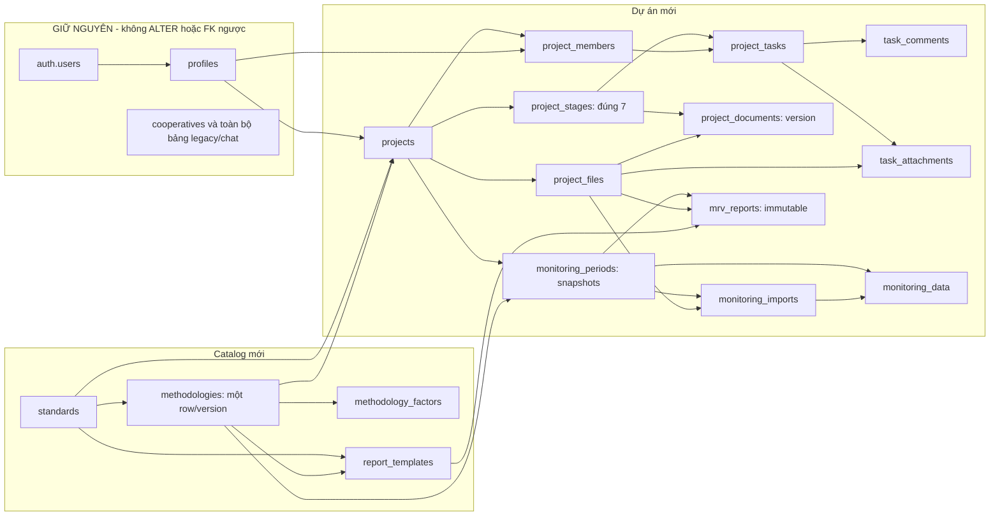

# Thiết kế schema nền tảng dự án Carbon Credit

Ngày 06/09/2026. Thiết kế theo `PLAN.md:27` và brief giai đoạn 2; spec project-layer ngày 05/09 bị thay thế. Đã đối chiếu cả `docs/audit/audit-keep.md` và `docs/audit/audit-replace.md`. Không lấy tên role/tổ chức từ spec cũ.

## Trạng thái bàn giao và quyết định chính

**Cập nhật bước 2b:** đã áp 0001–0014 trên PostgreSQL Docker cục bộ và chạy 78/78 ca SQL đạt sau sửa lỗi. **Không áp lên Supabase thật, không chạy e2e trỏ DB thật.** Xem [báo cáo kiểm chứng](schema-verification-report.md) về môi trường lệch phiên bản và các ca chưa kiểm được. Hai migration đề xuất:

- `supabase/migrations/0013_project_platform.sql`: 16 bảng, FK/index, validator, trigger, RPC, RLS, quyền cột/hàm và hai bucket private mới; tất cả trong một transaction.
- `supabase/migrations/0014_project_platform_samples.sql`: 2 Standard, 4 methodology MẪU, 5 dòng hệ số MẪU và 8 template placeholder; một transaction riêng. Seed chỉ phục vụ minh hoạ/preview.

Kiểm tra **tĩnh ban đầu ở bước 2**: 16/16 bảng có RLS và policy; 42 policy đều được liệt kê trong tài liệu; 43 FK có index nguồn và khóa PK/UNIQUE đích tương ứng; quyền hàm mới được thu hồi tường minh. Đã đối chiếu JSON trong tài liệu với seed, kiểm tham chiếu AST và tính hai ví dụ bằng Decimal. Bước 2b đã bổ sung kiểm thử PostgreSQL thật trong Docker; không đồng nghĩa đã kiểm Supabase Storage HTTP hay engine tính MRV.

**Không thêm giá trị vào `user_role`, không sửa `handle_new_user`.** `project_members.role` là `owner | developer | viewer`, độc lập hoàn toàn với `profiles.role`. Đăng ký hiện tại qua UI vẫn sinh `coop_manager` hoặc `buyer`; gửi metadata `coop_staff` được giữ, thiếu/giá trị lạ vẫn về `coop_staff` theo `supabase/migrations/0012_signup_role_guard.sql:33`. UI dự án mới nên mặc định đăng ký `coop_staff`, nhưng thay đổi UI/action thuộc bước 3, chưa làm trong đợt này.

Mọi user đã đăng nhập có `profiles` đều được gọi `create_project`, bất kể global role, không cần cooperative. Người tạo trở thành owner của project đó. Global `platform_admin` quản lý catalog methodology/template, **không tự có quyền đọc/ghi mọi project**. Một người có thể owner ở A, developer ở B. Vì không đổi enum cũ nên không phát sinh lỗi `ROLE_LABEL` hay thay đổi whitelist signup.

“Xoá project” chọn **xoá mềm** bằng `projects.deleted_at`: owner có thể xoá/khôi phục; thành viên vẫn đọc lịch sử, thao tác ghi task/monitoring/member bị chặn khi project đã xoá. Hard delete bị trigger chặn. Tệp và báo cáo bất biến để bảo toàn chứng cứ; thu hồi object/vĩnh viễn dữ liệu là quy trình riêng ngoài thiết kế này.

## Sơ đồ và ranh giới với DB cũ



Mũi tên cha → bảng chứa FK; các FK user khác được liệt kê dưới đây. Không có FK từ bảng cũ trỏ sang bảng mới. Mô hình mới không nối cooperative: tránh vô tình mở dữ liệu legacy cho thành viên dự án. Auth/chat và helper `app_is_admin()` vẫn giữ nguyên; chỉ gọi helper admin sẵn có trong policy catalog mới. Không sửa bảng `emission_factors`, không chạm bucket `evidence`.

## Danh mục bảng, cột và ràng buộc

Mặc định `id` là UUID PK, ngày giờ là `timestamptz`, giá trị đo exact dùng numeric/decimal string. **Tất cả FK mới dùng ON DELETE RESTRICT**; không tạo dây cascade sang dữ liệu giữ lại. PK/UNIQUE hoặc index riêng bao tiền tố mọi FK. PK membership `(project_id,user_id)` đã đáp ứng index được yêu cầu; thêm `user_id` cho danh sách project của một user.

| Bảng | Cột chính, khoá, ràng buộc và lý do |
|---|---|
| `standards` | `id,code UNIQUE,name,created_at`. Seed mã `VCS`, `GS`; đây là tên catalog, không ngụ ý nội dung demo được Standard chứng nhận. |
| `methodologies` | `standard_id FK,code,version,name,project_type,status,is_sample,professionally_validated,disclaimer,metric_schema,schema_hash,published_at,created_at`. UNIQUE `(standard_id,code,version)`, `(id,standard_id)`. Status draft/published; published bất biến, không sửa cả nhãn/is_sample. `schema_hash` generated SHA-256 theo JSONB::text PostgreSQL. Không thể công nhận một row sample bằng cách lật cờ; phải tạo version chuyên môn mới. |
| `methodology_factors` | `methodology_id FK,key,value numeric,unit,scope JSONB,source`; UNIQUE `(methodology_id,key,scope)`. Version kế thừa row methodology. Trigger khóa row methodology, chỉ thay factors khi draft; không dùng hệ số legacy. |
| `report_templates` | `standard_id FK,methodology_id,version,format(pdf/docx),status(placeholder/ready),bucket_id,object_path,checksum,mapping JSONB,disclaimer,created_at`. FK kép method/standard; UNIQUE `(methodology_id,version,format)` và `(id,methodology_id,standard_id)`. Placeholder buộc path/checksum NULL; ready bắt buộc có path + SHA-256. Bản ready bất biến, nội dung mới phải tạo version mới. |
| `projects` | `name,description,created_by FK profiles,standard_id FK,methodology_id,standard_locked_at,methodology_locked_at,baseline JSONB,baseline_revision,membership_revision,deleted_at,created_at,updated_at`. FK kép methodology/standard. Cho thiếu lựa chọn lúc Idea/Feasibility; có methodology thì phải có standard và là published. Khi khóa lựa chọn không thể thay/giải khóa. Baseline đổi tăng revision tự động; kỳ cũ giữ snapshot. |
| `project_members` | PK `(project_id,user_id)`; FK project/profiles, `role,joined_at`; UNIQUE `(project_id,user_id,role)` làm đích FK assignee. Trigger ghi `membership_revision` vào project để tuần tự hóa, không cho xóa/demote owner cuối cùng. |
| `project_stages` | `project_id FK,ordinal 1..7,title,approved_at,approved_by FK profiles`; UNIQUE `(project_id,ordinal)`, `(id,project_id)`. Trigger bootstrap tạo đúng 7 hàng, API không có quyền INSERT/DELETE stage; trigger chặn đổi identity/title/ordinal hoặc DELETE. Duyệt qua RPC owner, tuần tự, có kiểm khóa standard/methodology/baseline. |
| `project_tasks` | `project_id FK,stage_id,title,description,status(todo/in_progress/done/blocked),assignee_id,assignee_role='developer',due_at,position,created_by FK profiles,created_at,updated_at`; FK kép stage/project; FK ba cột `(project_id,assignee_id,assignee_role)` tới member cùng project có role developer. Assignee nullable; phải bỏ giao việc trước khi đổi role/xóa member đang được giao. |
| `project_files` | `project_id FK,uploaded_by FK profiles,bucket_id='project-documents',object_path,original_name,mime_type,size_bytes,checksum,created_at`; UNIQUE path và `(id,project_id)`. CHECK path bắt đầu bằng project_id/uploaded_by/…; ≤50 MiB. Metadata append-only. Checksum/path chưa chứng minh bytes thật; server phải kiểm tệp khi đăng ký/xuất. |
| `task_comments` | `project_id FK,task_id,author_id FK profiles,body,created_at`; FK kép task/project. Chỉ tác giả sửa body; owner có thể xóa comment trong project hoạt động. |
| `task_attachments` | `project_id FK,task_id,file_id,created_at`; FK kép task/project và file/project, UNIQUE `(task_id,file_id)`. Tháo liên kết không xóa file. |
| `project_documents` | `project_id FK,stage_id,file_id,kind(feasibility/baseline/additionality/pdd/other),version,created_at`; FK kép stage/project và file/project; UNIQUE `(project_id,kind,version)`. Mỗi loại tài liệu có chuỗi version append-only. |
| `monitoring_periods` | `project_id,methodology_id,standard_id,name,start_date,end_date,version,status(open/locked),schema_snapshot,schema_hash,baseline_snapshot,baseline_revision,factors_snapshot,data_revision,data_snapshot,locked_at,created_by FK profiles,created_at`. FK tới project và composite project/method/standard; FK method/standard; UNIQUE `(project_id,start_date,end_date,version)`; các UNIQUE scope cho bảng con. Date end≥start. Schema/baseline/factors/metadata bất biến từ khi tạo; khóa kỳ lưu data_snapshot và không cho sửa tiếp. |
| `monitoring_imports` | `project_id FK,period_id,file_id,mapping,mapping_hash GENERATED,schema_hash,imported_by FK profiles,created_at`; FK kép period/project,file/project; UNIQUE `(period_id,file_id,mapping_hash)` và `(id,period_id,project_id)`. Chỉ lưu import đã commit thành công; lỗi preview do ứng dụng trả, không để nửa batch trong DB. |
| `monitoring_data` | `project_id FK,period_id,record_key,observed_on,metric_values JSONB,raw_input JSONB,import_id,source_row,entered_by FK profiles,revision,updated_at`; FK kép period/project, FK ba cột import/period/project; UNIQUE `(period_id,record_key)`. Field trong JSON keyed theo schema; ngày đo nằm trong kỳ; imported row bắt buộc source_row, manual không có source_row. |
| `mrv_reports` | `project_id FK,period_id,methodology_id,standard_id,template_id,version,status(preview/final),schema_hash,schema_snapshot,baseline_snapshot,baseline_revision,factors_snapshot,data_revision,input_snapshot,template_snapshot,results,calculation_trace,engine_version,output_file_id,requested_by FK profiles,generated_at`. FK scope kỳ/project/method/standard, template/method/standard, file/project. UNIQUE `(period_id,version)`; final cần output. Toàn bộ row bất biến, mỗi lần sinh tạo version mới. |

Owner phải đồng thời là developer mới được assignee? **Không**: một membership chỉ có một role; theo PLAN, assignee chỉ là developer. Owner có toàn quyền chỉnh task nhưng không tự nhận task dưới role owner. Nếu sản phẩm muốn owner tự nhận, cần quyết định thay hợp đồng ở đợt sau, không nới ngầm trong SQL.

## Transaction, khóa và RPC

| RPC | Người gọi / hành vi |
|---|---|
| `create_project(name,description)` | authenticated có profile; INSERT project kích hoạt owner+7 stage cùng transaction. Không nhận created_by từ client. Thất bại bất kỳ bước nào rollback toàn bộ. |
| `set_project_member(project_id,user_id,role)` | Owner project hoạt động. Role NULL là xóa; còn lại upsert owner/developer/viewer. Khóa project trước khi kiểm quyền. Trigger kiểm owner cuối cùng, FK assignee chặn xóa/đổi developer đang được giao. Chưa có mời email; nhận UUID user đã biết. |
| `approve_project_stage(project_id,ordinal)` | Owner; khóa project, các stage trước phải đã duyệt. Stage ≥3 cần khóa Standard; ≥4 cần khóa Methodology; ≥5 validate baseline. Chưa kiểm chuyên môn Additionality/PDD. |
| `create_monitoring_period(project_id,name,start_date,end_date,version)` | Owner; khóa project, bắt buộc methodology đã khóa; lấy snapshots schema/hash/baseline/factors từ DB. Không nhận snapshots do client tự tạo. |
| `save_monitoring_records(period_id,records,expected_revision,file_id?,mapping?)` | Owner/developer; khóa project rồi period, validate và upsert cả batch 1–10.000 row; tăng data_revision **một lần/batch**. Payload record dùng key `values`, lưu vào cột SQL `metric_values`. Import cùng file_id+mapping_hash trả `already_imported` và không ghi lại, kể cả retry sau khóa kỳ. |
| `delete_monitoring_record(period_id,record_key,expected_revision)` | Owner/developer khi kỳ mở; xóa nếu có, tăng revision nguyên tử. |
| `lock_monitoring_period(period_id,expected_revision)` | Owner; chỉ kỳ mở, có dữ liệu, revision khớp. Snapshot tất cả observations theo thứ tự record_key, khóa một chiều. Hiệu chỉnh bằng kỳ version mới; không cho unlock kỳ cũ. |
| `create_mrv_report(period_id,template_id,results,trace,engine_version,requested_by,status,output_file_id)` | **Chỉ service_role**, backend đã xác thực user và chạy engine. RPC tự kiểm requested_by còn là owner/developer, project hoạt động, kỳ khóa, template đúng method/standard. Khóa period để cấp report version tuần tự. Final chỉ với non-sample + professionally_validated + template ready + file xuất; preview được dùng placeholder. |

Thứ tự khóa RPC: project → period → template khi cần. Membership ghi row project để hai owner không đồng thời xóa nhau; ở isolation cao có thể serialization failure, ứng dụng phải retry transaction thích hợp. FK assignee sử dụng role trong khóa, nên đổi role không thể để lại task gán viewer. DB owner là biên tin cậy; trigger/RLS không được thiết kế để chống quản trị DB có quyền sửa chính DDL.

Giữ `schema_hash` + snapshots trên cả period/report dù có dữ liệu lặp, để export/tái lập không cần đọc lại catalog hoặc baseline hiện hành. Draft observation có thể bị thay trước khi khóa; báo cáo chỉ sinh sau khóa, không hứa lưu mọi revision chỉnh sửa trước khóa. `revision` mỗi row là revision batch sửa gần nhất, không phải mọi row luôn bằng revision tổng kỳ.

## Toàn bộ policy và quyền truy cập

Mọi bảng mới bật RLS trong cùng transaction 0013; thu hồi quyền mặc định PUBLIC/anon/authenticated rồi cấp tối thiểu. SELECT policy cho bảng RPC-only là tường minh; **không có INSERT/UPDATE/DELETE policy không đồng nghĩa được ghi**. Các RPC SECURITY DEFINER kiểm quyền trước khi ghi với danh nghĩa owner DB. Không FORCE RLS lên membership, vì helper phải đọc bảng mà không tự đệ quy.

`app_project_role`, `app_project_ids`, `app_project_can_write` đều SECURITY DEFINER, `set search_path=public`, thu EXECUTE từ PUBLIC/anon và cấp authenticated. Hàm trigger/validator nội bộ bị thu quyền gọi trực tiếp. `project_json_hash` là hàm thuần có thể gọi bởi authenticated/service_role. Không có helper nhận user_id tùy ý để dò role người khác.

| Bảng | Policy đầy đủ | Ý nghĩa |
|---|---|---|
| standards | `standards_read`, `standards_insert`, `standards_update` | authenticated đọc; global admin thêm/sửa; không DELETE. |
| methodologies | `methodologies_read`, `methodologies_insert`, `methodologies_update` | Đọc published hoặc admin đọc draft; admin tạo draft/sửa/publish draft. Trigger làm published bất biến. |
| methodology_factors | `methodology_factors_read`, `methodology_factors_insert`, `methodology_factors_update`, `methodology_factors_delete` | Đọc theo visibility methodology; admin ghi/xóa chỉ draft, trigger kiểm lại dưới khóa. |
| report_templates | `report_templates_read`, `report_templates_insert`, `report_templates_update` | Đọc theo visibility methodology; admin thêm và sửa placeholder; ready bất biến; không DELETE. |
| projects | `projects_read`, `projects_update` | Member đọc kể cả đã xóa mềm; owner sửa các cột nội dung/lựa chọn/baseline/deleted_at. Không grant sửa id/creator/revision; INSERT chỉ RPC. |
| project_members | `project_members_read` | Member đọc danh sách thành viên cùng project; mọi ghi qua RPC owner. |
| project_stages | `project_stages_read` | Member đọc; sinh bởi bootstrap, duyệt bởi RPC owner; không ghi trực tiếp. |
| project_tasks | `project_tasks_read`, `project_tasks_insert`, `project_tasks_update`, `project_tasks_delete` | Member đọc; owner/developer project hoạt động ghi. INSERT creator=self; UPDATE chỉ stage/title/description/status/assignee/due/position, không đổi project. DELETE bị FK chặn nếu còn comments/attachments. |
| task_comments | `task_comments_read`, `task_comments_insert`, `task_comments_update`, `task_comments_delete` | Member đọc; owner/developer thêm với author=self; chỉ tác giả sửa body; tác giả/owner xóa khi project hoạt động. Viewer không comment trong v1. |
| project_files | `project_files_read`, `project_files_insert` | Member đọc; owner/developer thêm với uploader=self. Metadata không sửa/xóa. Backend có INSERT để đăng ký file report do server sinh. |
| task_attachments | `task_attachments_read`, `task_attachments_insert`, `task_attachments_delete` | Member đọc; owner/developer thêm/tháo liên kết cùng project; không UPDATE. |
| project_documents | `project_documents_read`, `project_documents_insert` | Member đọc; owner/developer thêm version; không sửa/xóa. |
| monitoring_periods | `monitoring_periods_read` | Member đọc; tạo/khóa theo owner RPC, không DML trực tiếp. |
| monitoring_imports | `monitoring_imports_read` | Member đọc metadata import; chỉ batch RPC ghi, append-only. |
| monitoring_data | `monitoring_data_read` | Member đọc; owner/developer ghi/xóa qua RPC kiểm schema/revision/lock. |
| mrv_reports | `mrv_reports_read` | Member đọc; backend RPC tạo, không UPDATE/DELETE. |

`service_role` bị thu DML thô trên các bảng mới; chỉ SELECT, INSERT project_files và EXECUTE RPC report/hash được cấp lại. Service role vẫn là secret mạnh, bypass RLS; ứng dụng tuyệt đối không đưa key xuống browser. Không dùng service role làm client cho thao tác CRUD thông thường; dùng JWT của user để RLS có hiệu lực. `platform_admin` không có membership sẽ không đọc project dù quản lý catalog.

## Storage và template thực tế

- `project-documents`: private, 50 MiB, PDF/DOCX/XLSX/CSV/JPEG/PNG/WebP. Path `{project_id}/{uploaded_by}/{object_uuid}/{filename}`; phải tạo object_uuid mới mỗi upload, không upsert. SQL kiểm hai prefix, giới hạn MIME/size nằm ở bucket; giới hạn chi tiết/parser nằm ở ứng dụng.
- `methodology-templates`: private, 50 MiB, PDF/DOCX; path `{methodology_id}/{object_uuid}/{filename}`. Admin upload; metadata template mô tả mapping field/report vào vị trí trong file, checksum/version/format. Mỗi template thuộc đúng một **version methodology**, methodology thuộc Standard; FK report buộc toàn chuỗi khớp.
- Policy `project_documents_objects_read`: member đọc prefix project; `project_documents_objects_insert`: owner/developer của project hoạt động, prefix uploader=self. Viewer không upload; member bị loại không còn quyền đọc object.
- Policy `methodology_templates_objects_read`: admin hoặc object đã đăng ký trong template ready thuộc methodology nhìn thấy; `methodology_templates_objects_insert`: admin và methodology tồn tại.
- `project_platform_objects_no_update`, `project_platform_objects_no_delete` là policy restrictive chặn authenticated ghi đè/xóa object trong **hai bucket mới**. Với evidence/bucket khác, điều kiện luôn true, không đổi quyền cũ. Không có bucket policy UPDATE/DELETE permissive mới. Service_role vẫn là biên tin cậy và phải tuân thủ append-only khi xuất báo cáo.

**Không có template chính thức thật trong repo.** Seed có 8 placeholder (4 methodology × PDF/DOCX), `object_path=NULL`, `checksum=NULL`, status placeholder. Không tạo file PDF/Word giả hoặc đường dẫn như thể file tồn tại. Để chạy export: cung cấp file có quyền sử dụng và mapping đúng từng Standard/methodology, upload object mới, kiểm bytes/hash, tạo hoặc hoàn thiện template ready. Preview có thể có results nhưng chưa có tệp xuất; final bị chặn đến khi đủ điều kiện.

## Hợp đồng metric_schema và import

Envelope v1 gồm `fields[]`, `factor_requirements[]`, `calculations[]`; kèm disclaimer, record_grain, decimal_encoding, runtime. Hai ví dụ đầy đủ bên dưới lấy nguyên JSON từ seed; không hard-code form/import theo tên methodology.

| Thành phần | Hợp đồng v1 |
|---|---|
| Field | `id` ASCII ổn định, unique; `label` đa ngôn ngữ; `type=decimal/integer/text/boolean/date/enum`; `scope=baseline/observation`; `required`; `unit`; `validation.minimum/maximum/exclusive_minimum/scale`; `ui.group/order`; `import.aliases/accepted_units`; enum có options value/label. |
| Giá trị | Decimal là chuỗi ASCII không exponent (`"12.5000"`), integer là JSON number, boolean đúng JSON boolean, ngày ISO. Không tự thay null bằng 0. Required kiểm tồn tại/non-null; v1 chưa coi chuỗi rỗng là thiếu đối với text. Values ngoài field id/scope bị từ chối. |
| Quan sát lặp | Một record/đối tượng/lần đo, key ổn định trong kỳ và ngày observed_on. Biểu diễn nhiều ô rừng, công tơ, hầm khí bằng nhiều record; v1 chưa có array lồng, cấu trúc quan sát nhiều loại hoặc quan hệ liên observation. |
| Factors | Key+unit phải tồn tại trước publish; `scope` JSONB độc lập. Seed dùng scope `{}`; engine tổng quát phải resolve chính xác một factor đúng selector, báo lỗi thiếu/mơ hồ, không tự lấy “gần đúng”. Toàn bộ bộ hệ số được snapshot để tái lập. |
| AST | Leaf `field`, `baseline`, `factor`, `calculation`, `constant`. Operator whitelist add/subtract/multiply/divide/min/max/pow; phép trừ/chia/lũy thừa 2 args, còn lại 2–16. Depth≤24, field≤200, calculation≤100. Calculation chỉ tham chiếu calculation đứng trước, không chu kỳ. **Không eval/JS/SQL nhúng.** |
| Tổng hợp | Mỗi calculation chạy trên từng observation, sau đó `aggregation=sum/mean/min/max` cho kỳ. Output unit tường minh. Không clamp số giảm âm thành 0. Seed minh họa không đủ để tính tín chỉ được issuance. |
| Runtime | Decimal precision 28, half-even, round output 4 số thập phân theo ví dụ. DB chỉ kiểm cấu trúc AST/type dữ liệu; chưa triển khai evaluator/kiểm đại số đơn vị. Backend phải kiểm tương thích đơn vị, invalid pow, chia 0, missing numeric, giới hạn thời gian/số phép toán. |

Import: đọc sheet/header CSV/XLSX → gợi ý bằng id/aliases → người dùng xác nhận mapping/unit → chuẩn hóa locale (dấu phẩy, phân cách nghìn), ngày Excel/ISO, empty/null → preview lỗi sheet/row/field → gọi **một** batch RPC. `raw_input` giữ raw cell/unit, `source_row` và file+checksum+mapping giữ nguồn. SQL không đọc Excel và không chạy macro/formula; parser không thực thi nội dung file. Các unit conversion (m²→ha, kWh→MWh…) là registry chung có version ở engine/parser, không viết riêng từng methodology; chuyển đổi trái dimensional type phải báo lỗi.

RPC bảo vệ type/required/bounds/enum/ngày tại DB để gọi thẳng PostgREST không bỏ qua validation. Các quyết định ở UI như mapping, xác minh thiết bị, review số liệu vẫn cần server kiểm trước lưu/chốt report. Import retry nhận diện bằng **file_id + mapping_hash + period**; upload lại cùng bytes thành file_id khác chưa được dedup theo checksum. Khi import lỗi, transaction rollback cả import metadata, observations và revision.

Seed có `DEMO-VCS-FOREST`, `DEMO-VCS-ENERGY`, `DEMO-GS-FOREST`, `DEMO-GS-BIOGAS`; phủ AFOLU, năng lượng, biogas. Hai demo forest cố ý dùng cùng cấu trúc để chứng minh form/engine không phụ thuộc tên Standard, còn template vẫn tách theo đúng cặp Standard/methodology/version. **Published chỉ có nghĩa bất biến kỹ thuật**, tất cả vẫn `is_sample=true`, `professionally_validated=false`.

Ví dụ dữ liệu và kết quả phép tính minh họa:

- VCS forest: baseline `{"baseline_stock_tc_ha":"10"}`; observation `{"plot_code":"P1","area_ha":"2","stock_tc_ha":"12"}` → 4 tC thay đổi, **14.6667 tCO2e** theo factor demo. Không phải chứng nhận credit rừng.
- GS biogas: baseline `{"baseline_capture_fraction":"0.1"}`; observation `{"digester_code":"D1","biogas_m3":"1000","methane_fraction":"0.6","equipment_type":"flare"}` → 0.402 tCH4, **9.7686 tCO2e** theo factor demo. Chưa tính leakage, vận hành thực, tổn thất thu hồi…

## Thứ tự áp dụng và rollback — hướng dẫn cho đợt sau

1. Reviewer kiểm SQL/permission/validator và chốt các giới hạn bên dưới. Không tự chạy `supabase db push` hay công cụ apply trong bước thiết kế này.
2. Người dùng quyết định môi trường được phép áp. Trước đó kiểm migration ledger thực tế, backup/restore, tên bảng/bucket chưa trùng; audit-keep ghi nhận ledger từ xa không trùng một-một số file, nên phải đối chiếu thay vì tự đánh dấu đã chạy. Không sửa 0001–0012.
3. **C8 đã chốt một đường áp/kiểm chứng:** runner gọi `psql -X -1 -v ON_ERROR_STOP=1 -f <file>` cho từng file 0001–0014. Đã bỏ BEGIN/COMMIT tường minh khỏi 0013/0014 để đồng nhất các migration cũ; runner là chủ transaction. Không bọc thêm BEGIN/COMMIT, không chạy từng đoạn, không dùng đường `supabase db push` thay thế trong quy trình đã kiểm này. Chỉ container cục bộ được phép ở bước 2b; ledger và quyền áp DB thật vẫn cần quyết định riêng. Một transaction bao toàn file, lỗi rollback file đó.
4. Áp 0014 sau 0013: seed 2 Standard/4 demo/5 factor/8 placeholder. Hai file không chứa ALTER enum cũ nên không có vấn đề dùng enum mới cùng transaction. Không ON CONFLICT để che trùng ID/bucket; lỗi trùng phải được kiểm tra.
5. Kiểm thử DB cô lập: gọi create_project đủ 1 owner+7 stage; thử hai owner cùng demote/xóa nhau; fake assignee/cross-project FK; thử viewer/outsider; draft/published/factor bất biến; direct DML monitoring bị cấm; nhập batch có 1 row lỗi rollback toàn bộ; retry import; data_revision lỗi; khóa kỳ chống writer đồng thời; mẫu/placeholder không final; template khác Standard/methodology bị chặn; object read/upload/delete theo role. Kiểm auth/chat giữ nguyên bằng hồi quy thật trên môi trường thử, không chỉ fixture.
6. Chỉ sau kiểm thử mới lên lịch áp môi trường thật với quyết định của người dùng. Migration không tự chuyển ứng dụng sang route mới và không di trú dữ liệu canh tác cũ.

Rollback an toàn: nếu lỗi trước COMMIT, rollback transaction hiện tại. Nếu 0013 đã commit nhưng 0014 thất bại, giữ schema rỗng và sửa bằng migration bổ sung được review, không chạy lại mù toàn bộ file. Nếu ứng dụng mới gặp lỗi sau áp: quay lại bản ứng dụng cũ, tắt entry point/RPC mới qua thay đổi quyền được duyệt khi cần; **giữ tất cả dữ liệu/bảng/bucket mới và cũ**. Thiết kế không cung cấp down migration phá hủy. Backup restore toàn project Supabase chỉ là phương án khẩn cấp có kế hoạch riêng vì có thể làm mất lịch sử chat mới phát sinh.

## Việc tầng ứng dụng phải làm ở bước 3–6

| Khu vực | Việc cần làm sau đợt schema |
|---|---|
| Auth/điều hướng | Giữ Supabase Auth và global role; default signup UI mới có thể là coop_staff. Sửa `src/app/auth-actions.ts:69`, `src/lib/auth.ts:42` (`homePathFor`) để về dashboard projects, viết `requireProjectMember(projectId)` riêng; không bắt người dùng mới tạo HTX. Không sửa các file này trong đợt thiết kế. |
| Types/nhãn | Regenerate `src/types/database.ts` sau kiểm DB thử, **giữ types legacy/chat/auth**. `src/lib/labels.ts:5` không cần thêm global enum; tạo nhãn project role/status riêng. Giữ ROLE_LABEL/region vì landing/chat đang dùng. |
| Middleware/menu | Thêm route dự án vào `src/middleware.ts:6`; thay menu `src/components/app-nav.tsx:6`; giữ hoặc redirect URL legacy được landing liên kết để tránh 404. Không bỏ các điểm mount chatbot hoặc `/quan-tri/tro-ly`. |
| Module A | UI chọn và khóa Standard/Methodology; gọi create_project/approve_stage/set_member. Board có 7 cột stage; kéo card qua cột đổi stage_id, status là thuộc tính riêng todo/in_progress/done/blocked theo PLAN. Cần UI xác nhận trước khóa và giải thích assignee chỉ developer. |
| Thành viên | Profile RLS cũ không tự cho xem tên người ở HTX khác; v1 DB chỉ trả membership UUID. Thêm endpoint danh bạ scoped theo project qua backend hoặc helper riêng được review, không mở profiles toàn cục. Luồng invite email/token/accept chưa có bảng/RPC trong v1 này. |
| Monitoring | Form/import renderer theo schema, registry đơn vị, Decimal evaluator và giới hạn AST; validate cùng hợp đồng DB; quản lý optimistic concurrency expected_revision; retry lỗi serialization; UI hiệu chỉnh bằng version kỳ mới. |
| Report | Backend lấy user từ session, tự tính từ snapshot kỳ khóa, không nhận results “đáng tin” từ client. Gọi create_mrv_report bằng service role chỉ sau authorization, cung cấp requested_by đã xác thực. Tạo client backend chuyên biệt, không mở rộng tùy tiện client admin hiện chỉ phục vụ chat_settings. Cấu hình service key nếu chưa có; giữ hoàn toàn ở server. |
| Template/tệp | Cần file thật của từng cặp/version, mapping template và PDF/DOCX renderer. Xác minh MIME, checksum bytes, object tồn tại, kiểm export output khớp template format, tên object mới mỗi version; không dùng upsert. Seed placeholder phải hiển thị “chưa có template”. |
| Test | Thêm test DB cô lập như danh sách trên, parser/unit/evaluator và export; chưa chạy `tests/e2e/flow.test.ts` vì test đó ghi DB thật. Unit fixture chat hiện không đủ chứng minh handler live tương thích. |

## Điểm chưa chắc và giới hạn cần reviewer xem kỹ

1. **Đã kiểm SQL thật trong Docker:** 14/14 migration và 78/78 ca SQL đạt trên PostgreSQL **17.0**, PostGIS **3.4.3/public**, khác đích 17.6/3.3.7. Đã chạy RLS, FK, quyền cột/RPC, trigger, khóa kỳ và hai kết nối owner đồng thời. Lỗi binding `name` trong policy storage và AST `op=null` đã được tái hiện/sửa rồi dựng DB sạch chạy lại. **C13 upload HTTP/TUS của Supabase Storage vẫn CHƯA KIỂM**, vì shim chỉ có bảng/hàm SQL, không có Storage service; không được suy từ INSERT SQL đạt ra upload API đạt. Chưa kiểm mọi nhánh RPC, isolation level và tải lớn. Xem báo cáo kiểm chứng để biết chính xác từng ca.
2. **Tính đúng chuyên môn MRV và template là chưa có**: số/công thức demo do nhóm tự soạn, không đại diện yêu cầu Verra/GS. DB chặn final từ sample; `professionally_validated` là cờ do admin chịu trách nhiệm, không phải xác minh tự động bởi Standard. Chưa có template chính thức để kiểm renderer.
3. Meta-schema v1 cố ý giới hạn scalar observations, không biểu đạt toàn bộ methodology thực tế (conditional required, array lồng, nhiều loại record, kiểm dimension biểu thức, aggregation có trọng số). `scope_selectors`, import/ui/runtime là hợp đồng cho ứng dụng; validator SQL hiện chưa xác minh toàn bộ metadata đó. Cần nâng schema_version khi mở rộng, không âm thầm đổi ý nghĩa bản v1 published.
4. Không cấm kỳ chồng thời gian; cho cùng khoảng ngày với version khác để hiệu chỉnh. Báo cáo không được cộng trùng các version kỳ; dashboard phải có quy tắc chọn bản hiệu lực trước khi tổng hợp. Hiện chưa có supersedes/current kỳ trong DB.
5. RPC ghi monitoring khóa project trước period, ưu tiên nhất quán quyền nhưng serialize cả các kỳ cùng project; cần đo tải thực. 10.000 row/RPC và snapshot JSONB lớn có thể chạm timeout/size; chia file thành các phần được người dùng xác nhận hoặc thiết kế staging/job ở phiên bản sau, không tự chia rồi mất tính nguyên tử toàn file.
6. Stage approval không thay thế thẩm định hồ sơ; không kiểm tất cả task done hoặc PDD thật. Khi baseline/task/document đổi sau duyệt, approval hiện không tự reset. Cần chốt workflow trước xây UI. Task có trigger cập nhật updated_at, nhưng chưa có bảng lịch sử từng lần sửa.
7. Tệp append-only gây orphan nếu upload thành công nhưng đăng ký metadata thất bại; cần job kiểm kê riêng. Xóa mềm project vẫn để thành viên đọc lịch sử là quyết định v1, cần phản hồi nếu sản phẩm muốn ẩn hoàn toàn. Backend service role vẫn có thể thay object trong storage; checksum cần được kiểm lại khi tải/xuất.

8. **C21 — không thể xóa auth.users đã được dữ liệu dự án tham chiếu.** Đã kiểm thực tế: DELETE auth.users → CASCADE tới profiles → FK `projects_created_by_fkey` RESTRICT trả SQLSTATE 23503. Toàn bộ lệnh vẫn nguyên tử và rollback, không xóa dở profile/chat; user/profile vẫn còn. Các FK member/tác giả/uploader/requested_by cũng có thể chặn xóa. Giữ nguyên RESTRICT. Quy trình thay thế cần thiết kế trước vận hành: vô hiệu hóa đăng nhập/thu hồi phiên qua backend quản trị phù hợp; xử lý chuyển owner/gỡ assignee nếu cần; giữ UUID và các dòng định danh, ẩn danh trường hiển thị/liên hệ qua thao tác có kiểm soát. Phải kiểm thêm dữ liệu cá nhân trong auth, nội dung chat, snapshot và file, vì chỉ đổi profiles.full_name/phone không ẩn danh toàn bộ lịch sử. Chưa triển khai hay thực thi quy trình ẩn danh trong bước 2b; C5 danh bạ/mời thành viên vẫn để Module A.

Các mục trên không cho phép bỏ qua ranh giới audit: bảng legacy, auth/chat, migration 0001–0012 và evidence giữ nguyên trong mọi trường hợp.

## Ví dụ metric_schema đầy đủ: Verra / DEMO-VCS-FOREST

**DỮ LIỆU MẪU DO NHÓM TỰ SOẠN, CHƯA ĐƯỢC THẨM ĐỊNH CHUYÊN MÔN; không phải trích dẫn hay methodology được Verra/Gold Standard công nhận.**

```json
{
  "schema_version": 1,
  "disclaimer": "DỮ LIỆU MẪU DO NHÓM TỰ SOẠN, CHƯA ĐƯỢC THẨM ĐỊNH CHUYÊN MÔN; không phải trích dẫn hay methodology được Verra/Gold Standard công nhận.",
  "record_grain": "Một đối tượng quan sát trong kỳ; record_key ổn định và observed_on ISO.",
  "decimal_encoding": "ASCII decimal string; không dùng ký pháp exponent",
  "fields": [
    {
      "id": "baseline_stock_tc_ha",
      "label": {
        "vi": "Trữ lượng carbon nền"
      },
      "type": "decimal",
      "unit": "tC/ha",
      "scope": "baseline",
      "required": true,
      "ui": {
        "group": "baseline",
        "order": 1
      },
      "import": {
        "aliases": [
          "baseline_stock_tc_ha",
          "Trữ lượng carbon nền"
        ],
        "accepted_units": [
          "tC/ha"
        ]
      },
      "validation": {
        "minimum": 0,
        "scale": 4
      }
    },
    {
      "id": "plot_code",
      "label": {
        "vi": "Mã ô đo"
      },
      "type": "text",
      "unit": "1",
      "scope": "observation",
      "required": true,
      "ui": {
        "group": "observation",
        "order": 2
      },
      "import": {
        "aliases": [
          "plot_code",
          "Mã ô đo"
        ],
        "accepted_units": [
          "1"
        ]
      }
    },
    {
      "id": "area_ha",
      "label": {
        "vi": "Diện tích ô đo"
      },
      "type": "decimal",
      "unit": "ha",
      "scope": "observation",
      "required": true,
      "ui": {
        "group": "observation",
        "order": 3
      },
      "import": {
        "aliases": [
          "area_ha",
          "Diện tích ô đo"
        ],
        "accepted_units": [
          "ha",
          "m2"
        ]
      },
      "validation": {
        "exclusive_minimum": 0,
        "scale": 4
      }
    },
    {
      "id": "stock_tc_ha",
      "label": {
        "vi": "Trữ lượng carbon đo được"
      },
      "type": "decimal",
      "unit": "tC/ha",
      "scope": "observation",
      "required": true,
      "ui": {
        "group": "observation",
        "order": 4
      },
      "import": {
        "aliases": [
          "stock_tc_ha",
          "Trữ lượng carbon đo được"
        ],
        "accepted_units": [
          "tC/ha"
        ]
      },
      "validation": {
        "minimum": 0,
        "scale": 4
      }
    }
  ],
  "factor_requirements": [
    {
      "key": "carbon_to_co2",
      "unit": "tCO2e/tC",
      "scope_selectors": []
    }
  ],
  "calculations": [
    {
      "id": "stock_change_tc",
      "unit": "tC",
      "aggregation": "sum",
      "expression": {
        "op": "multiply",
        "args": [
          {
            "op": "subtract",
            "args": [
              {
                "field": "stock_tc_ha"
              },
              {
                "baseline": "baseline_stock_tc_ha"
              }
            ]
          },
          {
            "field": "area_ha"
          }
        ]
      }
    },
    {
      "id": "estimated_change_tco2e",
      "unit": "tCO2e",
      "aggregation": "sum",
      "expression": {
        "op": "multiply",
        "args": [
          {
            "calculation": "stock_change_tc"
          },
          {
            "factor": "carbon_to_co2"
          }
        ]
      }
    }
  ],
  "runtime": {
    "dsl_version": 1,
    "precision_digits": 28,
    "rounding": "half_even",
    "output_scale": 4,
    "on_missing": "error",
    "on_division_by_zero": "error"
  }
}
```

## Ví dụ metric_schema đầy đủ: Gold Standard / DEMO-GS-BIOGAS

**DỮ LIỆU MẪU DO NHÓM TỰ SOẠN, CHƯA ĐƯỢC THẨM ĐỊNH CHUYÊN MÔN; không phải trích dẫn hay methodology được Verra/Gold Standard công nhận.**

```json
{
  "schema_version": 1,
  "disclaimer": "DỮ LIỆU MẪU DO NHÓM TỰ SOẠN, CHƯA ĐƯỢC THẨM ĐỊNH CHUYÊN MÔN; không phải trích dẫn hay methodology được Verra/Gold Standard công nhận.",
  "record_grain": "Một đối tượng quan sát trong kỳ; record_key ổn định và observed_on ISO.",
  "decimal_encoding": "ASCII decimal string; không dùng ký pháp exponent",
  "fields": [
    {
      "id": "baseline_capture_fraction",
      "label": {
        "vi": "Tỷ lệ thu hồi nền"
      },
      "type": "decimal",
      "unit": "1",
      "scope": "baseline",
      "required": true,
      "ui": {
        "group": "baseline",
        "order": 1
      },
      "import": {
        "aliases": [
          "baseline_capture_fraction",
          "Tỷ lệ thu hồi nền"
        ],
        "accepted_units": [
          "1"
        ]
      },
      "validation": {
        "minimum": 0,
        "scale": 4,
        "maximum": 1
      }
    },
    {
      "id": "digester_code",
      "label": {
        "vi": "Mã hầm khí"
      },
      "type": "text",
      "unit": "1",
      "scope": "observation",
      "required": true,
      "ui": {
        "group": "observation",
        "order": 2
      },
      "import": {
        "aliases": [
          "digester_code",
          "Mã hầm khí"
        ],
        "accepted_units": [
          "1"
        ]
      }
    },
    {
      "id": "biogas_m3",
      "label": {
        "vi": "Thể tích khí sinh học"
      },
      "type": "decimal",
      "unit": "m3",
      "scope": "observation",
      "required": true,
      "ui": {
        "group": "observation",
        "order": 3
      },
      "import": {
        "aliases": [
          "biogas_m3",
          "Thể tích khí sinh học"
        ],
        "accepted_units": [
          "m3"
        ]
      },
      "validation": {
        "minimum": 0,
        "scale": 4
      }
    },
    {
      "id": "methane_fraction",
      "label": {
        "vi": "Tỷ phần methane"
      },
      "type": "decimal",
      "unit": "1",
      "scope": "observation",
      "required": true,
      "ui": {
        "group": "observation",
        "order": 4
      },
      "import": {
        "aliases": [
          "methane_fraction",
          "Tỷ phần methane"
        ],
        "accepted_units": [
          "1"
        ]
      },
      "validation": {
        "minimum": 0,
        "scale": 4,
        "maximum": 1
      }
    },
    {
      "id": "equipment_type",
      "label": {
        "vi": "Loại thiết bị"
      },
      "type": "enum",
      "unit": "1",
      "scope": "observation",
      "required": true,
      "ui": {
        "group": "observation",
        "order": 5
      },
      "import": {
        "aliases": [
          "equipment_type",
          "Loại thiết bị"
        ],
        "accepted_units": [
          "1"
        ]
      },
      "options": [
        {
          "value": "flare",
          "label": {
            "vi": "Đốt khí"
          }
        },
        {
          "value": "generator",
          "label": {
            "vi": "Máy phát"
          }
        }
      ]
    }
  ],
  "factor_requirements": [
    {
      "key": "methane_density",
      "unit": "tCH4/m3_CH4",
      "scope_selectors": []
    },
    {
      "key": "methane_gwp",
      "unit": "tCO2e/tCH4",
      "scope_selectors": []
    }
  ],
  "calculations": [
    {
      "id": "recovered_methane_t",
      "unit": "tCH4",
      "aggregation": "sum",
      "expression": {
        "op": "multiply",
        "args": [
          {
            "field": "biogas_m3"
          },
          {
            "field": "methane_fraction"
          },
          {
            "factor": "methane_density"
          }
        ]
      }
    },
    {
      "id": "estimated_reduction_tco2e",
      "unit": "tCO2e",
      "aggregation": "sum",
      "expression": {
        "op": "multiply",
        "args": [
          {
            "calculation": "recovered_methane_t"
          },
          {
            "op": "subtract",
            "args": [
              {
                "constant": 1
              },
              {
                "baseline": "baseline_capture_fraction"
              }
            ]
          },
          {
            "factor": "methane_gwp"
          }
        ]
      }
    }
  ],
  "runtime": {
    "dsl_version": 1,
    "precision_digits": 28,
    "rounding": "half_even",
    "output_scale": 4,
    "on_missing": "error",
    "on_division_by_zero": "error"
  }
}
```
